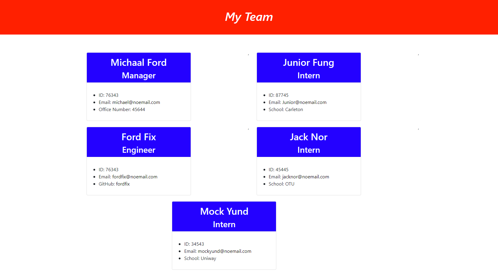

# Team-Member-Search

## Project Description

Application that takes in information about employees on a software engineering team and generates an HTML webpage that displays summaries for each person

## Table of Contents

1. [Usage](#usage)
2. [Questions](#Questions)
3. [Credits](#credits)
4. [Testing Instructions](#tests)
5. [License](#license)

## Installation Instructions

install node.js in the root directory. Type in the installation command to install (npm init) to install json, then install the inquirer by typing (nmp install inquirer) after that run the command (node index.js) to start the application

## Screenshot

## Languages

JavaScript,ES6,Node

## Usage

## Credits

## License

None

## Contributing

## Tests

None

## Questions

Contact me via my github profile or email address (links below)

1. Email address: wizeman22@outlook.com
2. Github Username: [Wizeeee](https://github.com/Wizeeee)
